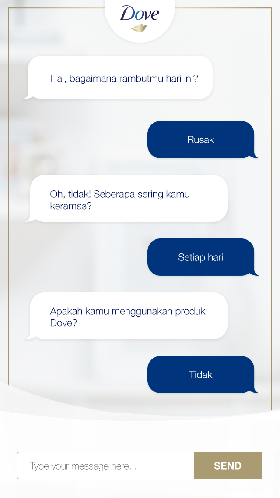

# static chat-bot

A dummy chat-bot to show the working of a chat-bot.
It uses a pre-defined set of QnA.
Design & layout is mobile-only.

<!--  -->

```
Tech stack used:
    - HTML
    - CSS 
    - Javascript

Dependencies:
    - lite-server

To start server:
    - npm start
```

